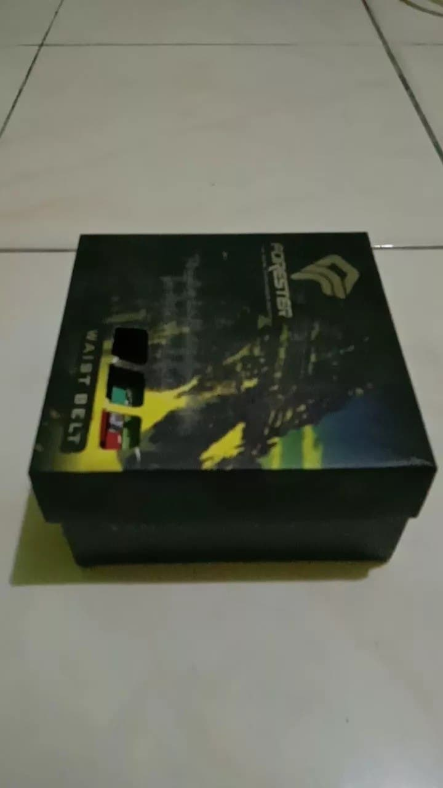
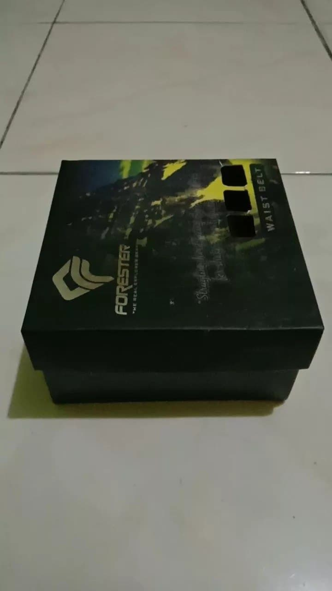
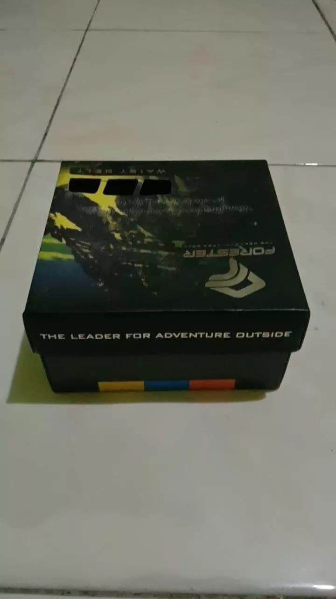
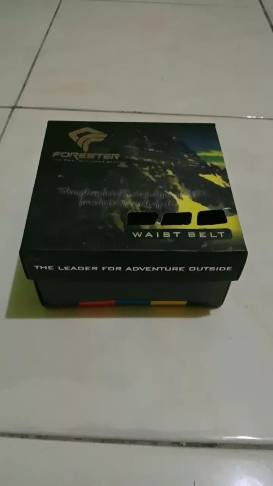

# tugas-1-junaediakbar
tugas-1-junaediakbar created by GitHub Classroom
 
 
Nama : Junaedi Akbar  
Nrp  : 05111940000041
 
 
Nama Benda : Kardus Ikat Pinggang  
Live Demo Tugas : <a href ="https://cg2021a.github.io/tugas-1-junaediakbar/"> LIVE DEMO TUGAS 1</a>

Foto dari sudut kanan atas:  

 
Foto dari sudut kiri atas:  

 
Foto dari sudut depan atas:  

 
Foto dari sudut belakang atas:  

 

# Tugas Three JS 
Tugas Individu (waktu 1 pekan)
1. Buat dan tampilkan beberapa geometri dan diberi animasi, beberapa obyek ditampilkan wireframe
2. Gunakan beberapa jenis material 
3. gunakan beberapa jenis lighting (AmbientLight, HemisphereLight, DirectionalLight, PointLight, Spotlights)

Berikut ada adalah objek objek yang saya buat:
Cube();
Circle();
Cone();
Cylinder();
Dodecahedron();
Extrude();
Icosahedron();
Lathe();
Plane();
Polyhedron();
Ring();
Tetrahedron();
Torus();
TorusKnot();
Tube();
Sphere();
Text();
Octahedron();

Material berupa : MeshNormalMaterial, MeshPhongMaterial, MeshStandardMaterial, MeshPhysicalMaterial
<frame src="https://cg2021a.github.io/tugas-1-junaediakbar/Tugas%20Three%20JS/" width="800px" height="600px"></frame>
Berikut link untuk <a href="https://cg2021a.github.io/tugas-1-junaediakbar/Tugas%20Three%20JS/">LIVE DEMO </a>

